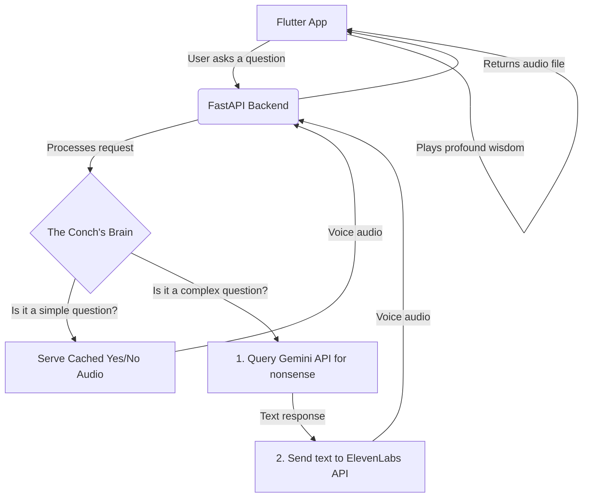

# TheConch Super App

### Your personal decision-maker for when you have zero emotional maturity.

_(Pro-tip: Record a short screen capture of your app and convert it to a GIF. This is the most important part of the README!)_

---

## 🐚 The Problem

In a world plagued by breakup season and crippling decision paralysis, we are often left with life's most difficult questions: "Should I text them?", "What should I eat?", "Is getting bangs _really_ the answer?".

Traditional wisdom is useless. You don't need good advice. You need vague, unhelpful, and instantaneous validation for your worst impulses.

**TheConch** is a revolutionary mobile "super app" that leverages cutting-edge AI and voice synthesis to provide the profound nonsense you crave. It's not a solution; it's an enabler.

**Built for the [Loophole Hackathon 2025].**

## ✨ Features

TheConch Super App offers three state-of-the-art modules to guide you through life's meaningless choices:

- 🔮 **The Classic Conch (Yes/No):** For life's simple binary decisions. Pull the sacred string and let the shell decide your fate with a simple "Yes," "No," or "Maybe someday."
- 🍕 **The Culinary Oracle (What to Eat?):** Can't decide what to eat? The Oracle will analyze the cosmic vibrations (and completely ignore your preferences) to suggest a food category in a serene, poetic voice.
- 🤔 **The Abyss of Ambiguity (Open-Ended Questions):** Pour your heart out. Ask the shell anything. Receive a beautifully spoken, deeply cryptic, and utterly useless piece of wisdom that sounds profound but helps in no way whatsoever.

## ⚙️ How It Works: The Architecture

We've over-engineered a solution to a problem that doesn't exist. The app uses a secure and scalable client-server architecture to protect our precious API keys and handle the AI-powered heavy lifting.

## 🚀 Tech Stack

- **Frontend:** Flutter
- **Backend:** Python (FastAPI)
- **AI Brain:** Google Gemini API
- **Voice:** ElevenLabs API
- **Deployment:** The backend is exposed to the internet using `ngrok` for hackathon purposes.

## 🛠️ Setup & Installation

Want to run this monument to poor decisions yourself?

### Backend

1.  Navigate to the `backend` directory: `cd backend`
2.  Install dependencies: `pip install -r requirements.txt`
3.  Create a `.env` file from the example: `cp .env.example .env`
4.  Add your API keys to the `.env` file.
5.  Run the server: `uvicorn main:app --reload`

### Frontend

1.  Navigate to the `frontend` directory: `cd frontend`
2.  Get packages: `flutter pub get`
3.  Update the backend URL in `lib/constants.dart` to your `ngrok` URL.
4.  Run the app: `flutter run`

---

## 💡 Future Roadmap: Expanding the Stupidity

The current version is just the beginning. Here's how we plan to make the world a more indecisive place:

- **The Wall of Shame:** An opt-in social feature where your most pathetic questions to the Conch are posted anonymously to a public feed for others to laugh at.
- **The Shellphone™:** A physical 3D-printed conch shell with an embedded Raspberry Pi, microphone, and speaker. Hold the shell to your ear to receive your terrible advice, just like the prophets of old.
- **Premium Bad Advice (Conch Coins):** A completely satirical in-app purchase system. Spend real money on "Conch Coins" to unlock even more vague and unhelpful answers from our "premium" wisdom models.
- **New Module: The Petty Post-Generator:** A new feature that uses an LLM to generate the perfect, passive-aggressive social media post aimed at your ex, complete with suggested emojis and a link to a 2008 pop-punk song.
