# TheConch Super App - Backend

### The Over-Engineed Brain of Profound Nonsense

This repository contains the server-side application for TheConch Super App. It's a Python backend built with FastAPI that serves as the core logic engine, handling requests from the mobile app, interfacing with various AI and data services, and ultimately producing beautifully spoken, unhelpful advice.

---

## 🏗️ Architecture Overview


## 📊 API Flow Diagram

```mermaid
sequenceDiagram
    participant Client as 📱 Flutter App
    participant API as 🚀 FastAPI Router
    participant LLM as 🧠 LLM Service
    participant TTS as 🎵 TTS Service
    participant Audio as 🎵 Audio Files
    participant Gemini as 🤖 Gemini API
    participant ElevenLabs as 🎤 ElevenLabs API

    Note over Client,ElevenLabs: Classic Conch Flow
    Client->>API: POST /api/classic {voice: "british_lady"}
    API->>TTS: get_speech_from_text("Yes", voice)
    TTS->>Audio: Return pre-recorded file path
    API->>Client: ConchResponse {message: "Yes", audio_url: "/audio/..."}

    Note over Client,ElevenLabs: Food Oracle Flow
    Client->>API: POST /api/what-to-eat {constraint: "vegan"}
    API->>LLM: get_llm_response(prompt)
    LLM->>Gemini: Generate food suggestion
    Gemini-->>LLM: "A mysterious grain bowl"
    LLM-->>API: Return suggestion text
    API->>TTS: generate_audio_for_text(text, voice)
    TTS->>ElevenLabs: Generate speech (future)
    ElevenLabs-->>TTS: Audio file
    TTS-->>API: Audio file path
    API->>Client: ConchResponse {message: "...", audio_url: "/audio/..."}

    Note over Client,ElevenLabs: Open-Ended Flow
    Client->>API: POST /api/ask-anything {question: "Should I quit?"}
    API->>LLM: get_llm_response(question, cryptic_prompt)
    LLM->>Gemini: Generate cryptic wisdom
    Gemini-->>LLM: "The river carves the stone..."
    LLM-->>API: Return cryptic answer
    API->>TTS: get_speech_from_text(answer)
    TTS->>ElevenLabs: Generate speech (future)
    ElevenLabs-->>TTS: Audio file
    TTS-->>API: Audio file path
    API->>Client: ConchResponse {message: "...", audio_url: "/audio/..."}
```



---

## ✨ Core Responsibilities

- **Receive Requests:** Listens for HTTP requests from the Flutter mobile app.
- **Process Logic:** Orchestrates calls to external APIs for AI-powered tasks.
- **Scrape Data:** Fetches real-world location data (only to ignore it).
- **Generate Audio:** Converts AI-generated text into high-quality speech.
- **Serve Responses:** Delivers the final audio files back to the app.

## ⚙️ Tech Stack

- **Framework:** [FastAPI](https://fastapi.tiangolo.com/)
- **Language:** Python 3.10+
- **AI Text Generation:** [Google Gemini API](https://ai.google.dev/)
- **AI Voice Synthesis:** [ElevenLabs API](https://elevenlabs.io/)
- **Web Scraping:** [SerpApi](https://serpapi.com/) for reliable Google Local results.
- **Environment:** `python-dotenv` for managing secrets.
- **Server:** `uvicorn` for ASGI server implementation.

---

## 🚀 Setup and Installation

Follow these steps to get the backend server running locally.

### 1. Prerequisites

- Python 3.10 or newer
- `pip` package manager

### 2. Clone the Repository

```bash
git clone <your-repo-url>
cd theconch_backend
```

### 3. Set Up Virtual Environment

It is highly recommended to use a virtual environment.

```bash
# Create the virtual environment
python3 -m venv venv

# Activate it (macOS/Linux)
source venv/bin/activate

# Activate it (Windows)
# venv\Scripts\activate
```

### 4. Install Dependencies

```bash
pip install -r requirements.txt
```

### 5. Configure Environment Variables

You will need API keys for the services used.

1.  Make a copy of the example environment file:
    ```bash
    cp .env.example .env
    ```
2.  Open the `.env` file and add your secret keys:
    ```
    GEMINI_API_KEY="YOUR_GOOGLE_GEMINI_API_KEY"
    ELEVENLABS_API_KEY="YOUR_ELEVENLABS_API_KEY"
    SERPAPI_API_KEY="YOUR_SERPAPI_API_KEY"
    ```

### 6. Add Static Audio Files

Ensure you have the pre-generated audio files for the Classic Conch feature placed in the correct directory:

- `audio/classic/yes.mp3`
- `audio/classic/no.mp3`
- `audio/classic/maybe_someday.mp3`
- ...etc.

---

## 🏃 Running the Server

### Local Development

To run the server with live reloading (restarts automatically on code changes):

```bash
uvicorn main:app --reload
```

The server will be running at `http://127.0.0.1:8000`.

### Interactive API Docs

Once the server is running, navigate to **`http://127.0.0.1:8000/docs`** in your browser to access the interactive API documentation (powered by Swagger UI). You can test all endpoints directly from this page.

### Production Deployment (Render)

This app is deployed on Render for production use. The API is accessible at:
**`https://your-app-name.onrender.com`**

For local development with the deployed backend:

- The Flutter app can connect directly to the Render URL
- No need for ngrok or local server exposure
- All endpoints are available via HTTPS

---

## 🌐 API Endpoints

**Base URL:** `https://your-app-name.onrender.com` (replace with your actual Render URL)

### 1. Classic Conch

- **Endpoint:** `POST /api/classic`
- **Request Body:**
  ```json
  {
    "voice": "deep_ah"
  }
  ```
- **Success Response:** `200 OK` with ConchResponse containing message and audio URL.

### 2. Culinary Oracle

- **Endpoint:** `POST /api/what-to-eat`
- **Request Body:**
  ```json
  {
    "constraint": "vegan",
    "voice": "deep_ah"
  }
  ```
- **Success Response:** `200 OK` with ConchResponse containing food suggestion and audio URL.

### 3. Abyss of Ambiguity

- **Endpoint:** `POST /api/ask-anything`
- **Request Body:**
  ```json
  {
    "question": "Should I quit my job?",
    "voice": "deep_ah"
  }
  ```
- **Success Response:** `200 OK` with ConchResponse containing cryptic wisdom and audio URL.

### Response Format

All endpoints return the same response structure:

```json
{
  "message": "The spoken text response",
  "audio_url": "/audio/path/to/generated/file.mp3"
}
```

---

## 📁 Project Structure

```
theconch_backend/
├── main.py                 # Entry point for the FastAPI app
├── requirements.txt        # Python dependencies
├── README.MD              # This file
├── TASKS.MD               # Development tasks and TODO list
├── CONCH_TRAITS.MD        # The Conch's personality guide
├── test.py                # Basic API tests
├── .env.example           # Environment variables template
├── config/                # Configuration files
│   ├── __init__.py
│   └── settings.py        # App settings and environment variables
├── models/                # Data models
│   ├── __init__.py
│   ├── requests.py        # Request body models
│   └── responses.py       # Response models
├── routes/                # API route handlers
│   ├── __init__.py
│   ├── classic.py         # Classic yes/no responses
│   ├── food.py            # Food suggestion endpoint
│   └── open_ended.py      # Open-ended question endpoint
├── services/              # Business logic layer
│   ├── __init__.py
│   ├── llm_service.py     # AI text generation service
│   └── tts_service.py     # Text-to-speech service
├── audio/                 # Static audio files
│   ├── classic/
│   │   └── british_lady/  # Pre-recorded responses
│   └── generated/         # AI-generated audio files
└── ASSETS/                # Raw audio assets
```

---

## 🔧 Environment Variables

Create a `.env` file in the root directory with the following variables:

```env
# AI Services
GEMINI_API_KEY="your_google_gemini_api_key"
ELEVENLABS_API_KEY="your_elevenlabs_api_key"

# Optional: Location Services (for future features)
SERPAPI_API_KEY="your_serpapi_key"

# Server Configuration
DEBUG=True
CORS_ORIGINS=["*"]  # Configure for production
```

---

## 🧪 Testing

Run the basic API tests:

```bash
python test.py
```

Or test individual endpoints using the interactive docs at `/docs` when the server is running.

---

## 🚀 Deployment Notes

- **Static Files**: Audio files are served from `/audio` mount point
- **CORS**: Configured to allow Flutter app origins
- **Environment**: Uses python-dotenv for environment variable management
- **Health Check**: Available at `/` endpoint for monitoring

---

## 🎯 Future Enhancements

- [ ] Implement ElevenLabs integration for dynamic voice generation
- [ ] Add user preference storage
- [ ] Implement rate limiting
- [ ] Add logging and monitoring
- [ ] Create automated testing suite
- [ ] Add voice cloning capabilities
